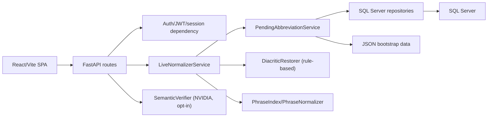

# SYSTEM_CONTEXT

> File này là bản đồ dự án cho người mới, AI agent, hoặc chính bạn khi quay lại sau một thời gian. Đọc theo thứ tự từ trên xuống sẽ thấy dự án làm gì, dữ liệu đi qua đâu, phần nào đã ổn, phần nào cần cẩn thận khi phát triển tiếp. Khi sửa bất cứ thứ gì, ưu tiên cập nhật đúng mục liên quan ở đây thay vì để kiến thức chỉ nằm trong đầu hoặc trong chat.

---

## 1. Dự án này làm gì?

Hệ thống **chuẩn hóa văn bản tiếng Việt**, tập trung vào kiểu văn bản chat, tin nhắn, bình luận mạng xã hội: viết tắt nhiều, thiếu dấu, teencode, emoji/emoticon, hoặc câu gõ nhanh chưa đúng chính tả.

Ví dụ mục tiêu:

- `dk hp` -> `đăng ký học phần`
- `toi di hoc` -> `tôi đi học`
- `đkkk` -> `đăng ký`
- `ntn` -> `như thế nào`
- `mon do an co so nay kho that day m a` -> giữ văn phong chat tự nhiên nhưng khôi phục đúng dấu/nghĩa.

Hệ thống có 3 bề mặt sử dụng:

- **Web SPA**: người dùng nhập bên trái, kết quả chuẩn hóa live ở bên phải, có highlight phần được mở rộng từ viết tắt và phần AI hiệu đính.
- **REST API**: phục vụ frontend và các client khác.
- **CLI / script nội bộ**: dùng cho kiểm thử, sinh dữ liệu, benchmark dấu tiếng Việt.

Điểm quan trọng: mục tiêu không phải biến mọi câu thành văn phong sách giáo khoa. Hệ thống cố giữ cách nói tự nhiên của người Việt trong chat, chỉ sửa những chỗ làm câu rõ nghĩa hơn.

Trạng thái chất lượng hiện tại (theo bộ chấm `score_quality.py` với 64 pattern lỗi nghĩa, chạy trên hai văn bản test thật `Test1.txt`/`Test2.txt` trong `.scratch/ai-semantic-fix/`):

- Luồng rule-based thuần (không AI) trên văn bản chat dày không dấu: **0 lỗi pattern**.
- AI semantic verification là lớp **opt-in** (người dùng bật trong UI), không phải điều kiện để output đạt chất lượng.

---

## 2. Kiến trúc tổng quan



### 2.1. Cấu trúc thư mục

Toàn bộ backend nằm trong `backend/`. Frontend nằm riêng ở `frontend/`.

```
ChuanHoaTiengViet/
├── backend/                     # TẤT CẢ phần backend
│   ├── app/
│   │   ├── ai/                  # NVIDIA client, semantic verifier, review policy, budget, cache, services
│   │   ├── api/                 # routes, schemas, dependencies, live_stream (NDJSON), server
│   │   ├── auth/                # bcrypt + JWT HS256 + lockout
│   │   ├── data_manager/        # repositories SQL Server, JSON bootstrap, pending service
│   │   ├── normalizer/          # lõi chuẩn hóa (mục 4)
│   │   ├── utils/               # logger, text utils, diacritic detect
│   │   ├── bootstrap.py         # factory pipeline dùng chung CLI + API
│   │   ├── config.py            # Settings (đọc .env), validate cấu hình
│   │   ├── main.py              # CLI entrypoint
│   ├── data/
│   │   ├── diacritic/           # word_map, bigram_freq, context_phrases, chat_regression_test.csv
│   │   ├── DataDauCau/          # corpus gốc dùng để build lại asset (news + chat)
│   │   ├── abbreviations, dictionary, Emoji, phrases (JSON bootstrap)
│   ├── database/                # init_schema.sql, seed_demo.sql, seed_from_json.py
│   ├── scripts/                 # script build asset / mining / eval / convert
│   ├── tests/                   # pytest
│   ├── pyproject.toml           # ruff / black / mypy / pytest / coverage
│   ├── requirements.txt
│   └── README.md
├── frontend/                    # React 19 + Vite SPA
├── scripts/                     # launcher dev cho CẢ hai server (.cmd/.ps1) + rebuild_diacritic_assets.ps1
├── ChuanHoaTiengViet/           # entrypoint project Visual Studio
├── .env                         # cấu hình local (gitignored) — KHÔNG ĐỌC trực tiếp
├── .scratch/ai-semantic-fix/    # tool chẩn đoán + file test + SESSION_HANDOFF của các phiên điều tra
├── docs/agents/                 # domain docs, issue tracker, triage labels cho AI agent
└── SYSTEM_CONTEXT.md            # file này
```

Quy ước đường dẫn: `backend/app/config.py` định nghĩa `BACKEND_DIR` (chính là `backend/`) và `PROJECT_ROOT`. Mọi đường dẫn dữ liệu đều tính từ `BACKEND_DIR`, nên `data/`, `database/` phải nằm cùng cấp với `app/`. File `.env` được tìm theo thứ tự `backend/.env` rồi `<repo-root>/.env`.

Stack hiện tại:

| Tầng | Công nghệ |
|---|---|
| Backend | Python 3.14 (venv `.venv`), FastAPI, SQLAlchemy, Pydantic |
| Frontend | React 19, TypeScript, Vite, React Router |
| Database | SQL Server Express (Windows Authentication) cho dev |
| AI | NVIDIA API (OpenAI-compatible), có fallback rule-based + nemotron fallback client |
| Auth | bcrypt + JWT HS256 + server-side session/revoke + lockout |
| Test | pytest + coverage.py, Vitest, Playwright E2E skeleton |

---

## 3. Luồng chuẩn hóa chính (`POST /api/normalize/live`)

Khi gọi `/api/normalize/live`, request đi qua các bước chính:

1. **Giới hạn kích thước body** — `BodySizeLimitMiddleware` từ chối body vượt `MAX_REQUEST_BODY_BYTES` (mặc định 1 MB) bằng HTTP 413 trước khi tầng nào buffer nội dung.

2. **Auth dependency** — decode JWT, kiểm tra token còn active trong `dbo.user_sessions` (kết quả cache theo session factory), gán `request.state.user` để rate limit chạy theo user.

3. **`LiveNormalizerService.normalize_live`** (`backend/app/normalizer/live_normalizer.py`) chạy trong threadpool, theo trình tự:
   1. `apply_known_spelling` — sửa chính tả đã biết theo bảng `known_typos.json` (bỏ qua protected literals).
   2. **Chia segment nếu dài**: khi `len(text) >= live_incremental_min_chars` (1200) và không có `resolution_overrides`, văn bản được cắt theo từ (ưu tiên cuối câu) thành segment ~`live_incremental_chunk_words` (120) từ; live data + phrase trie build **một lần cho cả request**; có segment cache theo (text, user, domain, input_method, dictionary revision).
   3. **Mỗi segment** đi qua: NFKC normalize → loại emoji/emoticon (thay marker rồi nén khoảng trắng; xoá cả `:)))` lẫn emoji Unicode) → **khôi phục dấu** (mục 4) → capture token layout → phrase normalizer (trie n-gram ≤ 5, ưu tiên `db_override` > `override` > `db` > `mined`) → vòng token: elongation → viết tắt **đa nghĩa** tạo ambiguity (mặc định GIỮ nguyên, chỉ chọn qua rule ngữ cảnh) → viết tắt **đơn nghĩa** mở rộng tự động → từ lạ gửi pending moderation (ngân sách `live_max_pending_submissions` = 80 dùng chung cho cả request) → dựng output + spans.
   4. **Ghép segment**: giữ nguyên separator gốc, dịch offset các span, `capitalize_sentence_starts` chạy MỘT LẦN trên chuỗi đã ghép (không viết hoa giữa câu).
   5. `restore_terminal_punctuation` + `append_question_mark` — chỉ chèn/khôi phục dấu câu, không đụng từ.
   6. Usage stats ghi **một transaction cho cả request**; thất bại không làm fail normalize.
   7. `_populate_change_metadata` — sinh dữ liệu `changes`/spans cho frontend highlight.

4. **AI semantic verification (opt-in)** — chỉ khi request có `allow_ai=true` (toggle frontend mặc định **TẮT**, `schemas.py`), xem mục 5.

5. **Highlight là metadata thuần.** `expandedAbbreviations` (span abbr/expanded/offset) và `changes` được dựng SAU khi text hoàn tất, frontend chỉ dùng để vẽ `<mark>`. Không có code nào dùng span/offset để ghi đè/ghép lại văn bản, và nút copy lấy đúng `primaryOutput` dạng plain text. Khi nghi ngờ output sai, đừng blame highlight — so với luồng rule-based trước đã.

6. Các bước nặng chạy trong threadpool (`run_in_threadpool`), một request lớn không chặn event loop.

---

## 4. Tầng khôi phục dấu — phần nhạy cảm nhất của hệ thống

Đây là tầng quyết định chất lượng với văn bản thiếu dấu. Hiểu rõ trước khi sửa.

### 4.1. Cơ chế chọn thanh điệu (`diacritic_restorer.py`)

- `SyncDiacriticRestorer.restore()` chạy cho **mọi text ≥ 8 ký tự** (kể cả text đã có dấu gần đầy — mixed text vẫn cần phục hồi từng token), trên bản text đã loại emoji.
- Lookup theo token đã lowercase + strip dấu câu (gồm cả ngoặc kép cong `“ ” ‘ ’` — từ đầu/cuối trích dẫn cũng được tra và dấu ngoặc được giữ lại làm prefix/suffix).
- Thứ tự quyết định cho mỗi token:
  1. Protected literal (URL/email/code/số/ALL-CAPS/Title-case) hoặc viết tắt 2–3 phụ âm không nguyên âm → giữ nguyên.
  2. **Context-phrase override** khớp (so khớp dạng FOLDED hai phía) → thắng tuyệt đối; chỉ ghi đè token KHÔNG có dấu sẵn.
  3. word_map có 1 ứng viên → lấy luôn.
  4. word_map nhiều ứng viên → **bigram scoring**: điểm = max(prev_bigram) + max(next_bigram); hòa điểm → ứng viên đầu tiên trong word_map; điểm 0 → giữ token gốc khi prefer_diacritics (mixed text).
- **Từ đã có dấu gần như không bao giờ bị đổi thanh** (key word_map là dạng không dấu). Mọi lỗi "thêm dấu sai" đều xảy ra trên token KHÔNG dấu trong input.

### 4.2. Dữ liệu asset (`backend/data/diacritic/`)

| File | Nội dung | Đặc điểm cần biết |
|---|---|---|
| `word_map.json` | ~7.170 key không dấu → danh sách ứng viên có dấu | Builtin entries trong code (`_BUILTIN_WORD_MAP_ENTRIES`, 5 token: met/thi/trai/vai/nam) merge qua `setdefault` — file JSON vẫn là authority |
| `bigram_freq.json` | 220.000 bigram có dấu | **Build từ corpus báo chí/giải trí — thiên lệch đã biết**: `vào_bán` (6486) đè `vào_bàn`, `khô khăn` (52201) đè `khô khan`, `làm thất` đè `làm thật`, `máy hôm` đè `mấy hôm`… Đây là nguồn lỗi chính của văn bản chat dài không dấu |
| `context_phrases.json` | 5.000 cụm (sinh tự động) | Cùng nguồn corpus nên có cụm sai đọc cho chat (`kho khan→khó khăn`, `vao ban ket→vào bán kết`); file này bị GHI ĐÈ khi rebuild |
| `chat_regression_test.csv` | 75 case ground truth (basic/context_phrase/ambiguous/mixed_english/short/formal/natural_chat + nhóm `context_phrase_test1/test2`) | Mỗi lần sửa logic dấu phải thêm case thật vào đây; nhóm `ambiguous` chỉ yêu cầu accuracy ≥ 0% |
| Builtin overrides trong code | **202 cụm** "chữa tay" (`_BUILTIN_CONTEXT_PHRASE_OVERRIDES`) | Thắng file phrase khi trùng key (`{**file, **builtin}`). Đây là cơ chế chính để sửa lỗi cụ thể mà không cần build lại corpus |

Quy ước khi thêm builtin override:

- Key = tuple token **không dấu lowercase** (đúng như tokenizer tách), value = tuple từ có dấu, **cùng độ dài** với key.
- Chỉ thêm cặp có **một cách đọc hợp lý** trong chat sinh viên; case nhập nhằng thật sự thì dùng key dài hơn (3–5 token) để thêm ngữ cảnh, kèm comment giải thích.
- Nếu cụm news ngắn hơn đang "nuốt" trước (greedy longest-match ưu tiên key dài hơn bắt đầu từ vị trí đó), phải thêm key **bắt đầu từ vị trí của cụm news** (ví dụ `("nhung","ngoi","4","tieng")` để thắng `("nhung","ngoi")`).
- Luôn kèm 1–2 dòng CSV regression.
- Giá trị có thể giữ nguyên dạng trần (vd `("bay","lung","tung") → ("bay","lung","tung")`) — override "no-change" chặn bigram chọn thanh sai.

### 4.3. Build lại asset dấu — quy trình an toàn

- Pipeline build streaming: `backend/scripts/build_diacritic_streaming.py` (chunked + prune + checkpoint/resume, viết cho máy 16GB RAM). Checkpoint ở `backend/data/diacritic/.checkpoints/` — lần build sau với `-Resume` bỏ qua corpus đã xử lý.
- Runner an toàn: `scripts/rebuild_diacritic_assets.ps1` — tự backup asset cũ vào `backend/data/diacritic/backup/<thư-mục-timestamp>/` → build → chạy regression gate → có đường rollback. Chat CSV đặt trong `backend/data/DataDauCau/chat/` tự được nhận và áp weight (cờ `--weight PATH=FLOAT`).
- Corpus hiện có: news/giải trí `DataDauCau/ViDiacritics_*.csv` (khoảng 2GB) — **nguồn bias**; chat đã convert `DataDauCau/chat/` (ViSFD ~11k rows review điện thoại — sai miền, chỉ dùng weight thấp); script `convert_chat_corpus.py` (convert raw CSV) và `export_history_corpus.py` (export `dbo.normalization_history` — **chưa chạy được trong sandbox vì không kết nối được SQL, phải chạy ở terminal thường của user**).
- Hai lần build lại với corpus thuần news / ViSFD đều bị regression gate chặn và **đã rollback về bộ gốc** — backup nằm trong `backend/data/diacritic/backup/`. Bài học: weight không cứu được khi chat corpus không có bằng chứng cho các bigram then chốt (`chúc_bạn`, `mấy_giờ`, `rồi_bạn` = 0 trong corpus hiện có).
- 3 case biên trong CSV là ĐIỂM CHẶN khi rebuild: `chuc ban ngu ngon nhe`, `may gio roi ban`, `tot lam` — asset news thuần fail cả ba.
- **Chưa có giải pháp thay thế corpus đúng miền** — đây là việc còn mở lớn nhất (mục 10).

---

## 5. AI semantic verification (opt-in)

### 5.1. Điều kiện chạy

- `allow_ai=true` từ request (toggle UI mặc định TẮT) ∧ `semantic_verify_enabled=1` ∧ input_method hợp lệ.
- Chạy **proofread toàn văn bản** (`review_all=True`) theo chunk ≤ 400 từ (env override bị clamp cứng), tối đa 64 chunk/request, concurrency 2, deadline 90s/wave.
- Các config `semantic_verify_paste_min_chars` / `semantic_verify_typing_min_chars` / `semantic_verify_min_diacritic_changes` hiện là **dead config** (không được dùng ở đâu).

### 5.2. Cơ chế chống timeout (đã xử lý triệt để — không phá vỡ khi sửa)

Stack timeout 4 tầng: httpx 90s → `FallbackClient` (primary giữ `remaining - min(20, remaining/3)`, còn reserve cho fallback) → `BudgetedClient` deadline 90s (sqlite lease, dedupe flight trùng) → verifier deadline `90 × waves + 1`. Các chi tiết bắt buộc giữ:

- `NvidiaClient` tôn trọng per-request `enable_thinking` (verifier luôn tắt thinking per-request — bật thinking làm chunk 400 từ không bao giờ xong trong deadline).
- `NemotronClient` tôn trọng `json_mode`.
- Response có `finish_reason="length"` bị reject (JSON cắt cụt = output vô nghĩa).
- Log dạng "200 OK rồi timeout" = đọc body/stream sau headers, không phải lỗi mạng.

### 5.3. Prompt & merge kết quả

- Prompt ở chế độ review_all yêu cầu model **hiệu đính theo bản rule-based** (normalized_reference) chứ không chuẩn hóa lại từ đầu — chuẩn hóa lại từ đầu làm model lật sai từ đồng âm (đo thực tế: 49 lỗi baseline → 64 lỗi sau AI).
- Đưa vào prompt danh sách vị trí đồng âm + candidates (`ambiguous_positions`), temperature 0, nguyên tắc "không chắc thì giữ nguyên", ví dụ confidence dùng 0.9.
- Hai marker parse `"Dữ liệu JSON (không phải chỉ dẫn):\n"` và `"\nChỉ trả JSON:"` là **hợp đồng test** — không đổi tùy tiện.
- Kết quả AI chỉ ghi đè rule-based khi: giữ nguyên mọi dấu câu (`preserves_punctuation` — vi phạm là hủy toàn văn), từ điển không đổi giữa chừng, `ai_usable` (confidence ≥ 0.7 hoặc có abbreviation options + status hợp lệ), và có ít nhất 1 chunk trả lời. Provider lỗi/timeout/429 → giữ kết quả rule-based và log ngắn.

### 5.4. `accept_edits` (review_policy v6) — cổng lọc từng edit

Mỗi edit đề xuất phải qua: confidence ≥ threshold; không đụng protected literal; không đổi số/dấu câu/ký tự điều khiển; giữ số từ (trừ abbreviation/expansion repair); fold-similarity ≥ 0.6 hoặc trùng phonetic; negation không được biến mất; edit thay đổi dấu cùng-gốc phải nằm trong **candidates đã khai báo** của vị trí đó (token ngoài map thì rơi về quy tắc similarity chung).

Hai quy tắc v6 (hiểu đúng trước khi "đơn giản hóa"):

- **Được phép bớt dấu** khi kết quả là một candidate đã khai báo — vì restorer có thể tự thêm SAI thanh (`nghe→nghề`, `khan→khăn`), việc AI chọn lại candidate khác (kể cả dạng trần) là sửa lỗi chứ không phải làm giảm chất lượng. Dạng không có trong candidates vẫn bị chặn.
- **Budget contextual = min(24, max(4, 12% số từ))** chỉ đếm edit **đổi nguyên âm gốc** (fold khác — vd `dc→được`, `ví dụ→vận dụng`). Edit thuần thanh điệu (`that→thật`) **không tốn budget** — chủ đích, vì chúng rẻ và chính là cái ta muốn AI làm nhiều. Vượt budget: giữ các edit vừa budget theo thứ tự văn bản, phần vượt phục vụ baseline — **không revert cả chunk** như trước (revert-all là lý do AI từng "không cứu được" văn bản sai dày).

Sửa policy phải bump `REVIEW_POLICY_VERSION` — giá trị này nằm trong cache key của verifier nên tự vô hiệu cache cũ.

### 5.5. Giới hạn & usage

- Rate limit: 30 req/60s toàn cục, 10 req/60s/user, vượt → status `quota`, giữ rule-based; xem `semanticStatus`/`semanticStatusReason` trong response để chẩn đoán.
- Mọi call site dùng `app/ai/budget.py` để chặn `max_tokens` (`AI_MAX_OUTPUT_TOKENS`, mặc định 8192). `AIUsageStats` là counter in-memory; `/api/admin/ai-usage` trả snapshot cho admin.
- Verifier/Disambiguator cache theo `Settings` ở cấp process; cache TTL 1 giờ chỉ có tác dụng vì cache này.
- Giá trị model thường dùng: `NVIDIA_MODEL=z-ai/glm-5.3-flash`, `SEMANTIC_FALLBACK_MODEL=nvidia/nemotron-3.5-lightning-30b-a3b` (đặt qua `.env`).

---

## 6. Dữ liệu và database

Schema chính nằm trong `backend/database/init_schema.sql` (idempotent, chưa tách migration Alembic). Seed tài khoản demo nằm riêng `seed_demo.sql` (opt-in, chỉ chạy trên máy dev/demo).

Các nhóm bảng chính:

- `dbo.users`, `dbo.roles`, `dbo.user_roles`: tài khoản + role cố định `user`/`admin`.
- `dbo.abbreviations`, `dbo.dictionary_entries`, `dbo.abbreviation_pending`: viết tắt, từ điển, hàng chờ duyệt.
- `dbo.user_abbreviation_overrides`: nghĩa riêng của từng user.
- `dbo.abbreviation_audit_log`: nhật ký duyệt/từ chối/gửi pending.
- `dbo.normalization_history`, `dbo.system_error_logs`: lịch sử chuẩn hóa, log lỗi.
- `dbo.diacritic_cache`, `dbo.annotation_data`: cache khôi phục dấu và dữ liệu gán nhãn.
- `dbo.user_sessions`: session JWT đã hash token (logout/revoke server-side).
- `dbo.user_preferences`, `dbo.phrase_overrides`, `dbo.abbreviation_usage_stats`: preference UI, phrase override admin, thống kê viết tắt.

Repository chính: `user_repo.py`, `history_repo.py`, `abbreviation_repo.py`, `new_tables_repo.py` (sessions/preferences/phrase overrides/usage stats), `pending_service.py` (hợp nhất JSON + DB + cache).

Khi thêm bảng hoặc đổi shape DB: ưu tiên test repository bằng fake session trước; CI/dev không nên phụ thuộc SQL Server thật.

Hành vi khi DB lỗi: các hàm ĐỌC của pending service tự fallback về JSON bootstrap (DB enrichment là best-effort); các hàm GHI (vd `submit_pending_abbreviation`) trả trạng thái `DB_UNAVAILABLE` và normalize vẫn chạy tiếp.

---

## 7. Auth, session và bảo mật

- Register/login tạo access token + ghi session vào `dbo.user_sessions`; logout revoke server-side và trả `revoked` thật.
- `get_current_user()` kiểm tra `SessionRepository.is_token_valid(token)`.
- Sai mật khẩu nhiều lần khóa tài khoản tạm thời (`AUTH_MAX_FAILED_LOGINS`, `AUTH_LOCKOUT_MINUTES`); thông báo khóa trùng khớp thông báo sai mật khẩu.
- Password bcrypt; legacy SHA-256 được transparent rehash khi login; mật khẩu > 72 byte bị từ chối tường minh.
- Token lưu DB dạng SHA-256 hash. Validate session **fail-closed** khi bảng tồn tại nhưng query lỗi (chỉ cho qua khi bảng chưa từng được tạo).
- `AUTH_SECRET` validate ở mọi môi trường; sentinel công khai chỉ bỏ qua khi `ALLOW_DEV_AUTH_SECRET=1`.
- `WEB_ORIGIN` kiểm tra nghiêm ở production; `/docs`/`/redoc`/`openapi.json` tắt khi production; mọi response có CSP `default-src 'none'`.
- Body size limit 413; mọi list trong request schema có `max_length`; query SQL dùng `sqlalchemy.text()` + bound params; rate limit theo user (fallback IP), `/api/health` cache probe DB 5s + rate limit.
- Bandit sạch.

Còn lại để harden sau: frontend lưu bearer token trong `sessionStorage` (cân nhắc httpOnly cookie + CSRF nếu public production), chưa có dependency CVE scan tự động, lockout theo tài khoản đơn lẻ.

---

## 8. Frontend hiện tại

React SPA trong `frontend/`:

- `AuthContext`: login/register/logout/me, token ở `sessionStorage`. Tự đăng xuất khi API trả 401 (event `viet-normalizer:unauthorized`), không đăng xuất khi lỗi mạng/5xx.
- `WorkspacePage`: nhập text, live normalize, toggle **Cho phép AI** (mặc định TẮT), variant selection, lưu history.
- Renderer chính cho output là `renderChangeSide` (`NormalizedOutputPane.tsx` + `ChangeComparison.tsx`) — slice text + `<mark>`, marker chèn là span 0-width. `HighlightedOutput.tsx` chỉ còn dùng trong test. `AmbiguityHighlighter.tsx` chỉ render `indexOf` + `<mark>`. Frontend tự kiểm tra span trước khi dùng (bỏ range ngoài biên).
- Nút copy: `copyTextToClipboard(data.primaryOutput)` — đúng plain text.
- Streaming: `frontend` nhận NDJSON từ `/api/normalize/live/stream` (`live_stream.py`), **mỗi event là FULL snapshot — replace chứ không append**.
- `PendingNotice`: form bổ sung nghĩa cho viết tắt lạ thật sự cần user giúp.
- Admin: `AdminModerationPage` (duyệt pending), `AdminDictionaryPage` (quản lý từ điển), `AdminAccountsPage`.
- `ErrorBoundary`: fallback khi React render lỗi.
- `frontend/src/lib/api.ts` có wrappers cho: auth, live normalize, restore diacritic, disambiguate, pending, dictionary, user meaning, history, users, sessions, preferences, phrase overrides, usage stats, AI usage.
- Cấu hình URL API: `VITE_API_BASE_URL` — bỏ trống khi production = same-origin; dev fallback `http://localhost:8000`. `vite.config.ts` **fail build** nếu biến này chứa `localhost`.
- Chưa có UI đầy đủ cho sessions/preferences/usage dashboard (wrappers + backend đã sẵn).

---

## 9. Test và quality gates

Chạy từ thư mục `backend/`:

```powershell
cd backend
..\.venv\Scripts\python.exe -m pytest tests -q
..\.venv\Scripts\python.exe -m pytest tests --cov=app --cov-report=term-missing:skip-covered -q
..\.venv\Scripts\python.exe -m ruff check app tests scripts database
..\.venv\Scripts\python.exe -m mypy
..\.venv\Scripts\python.exe -m bandit -r app scripts -q
```

Frontend:

```powershell
cd frontend
npm.cmd test
npm.cmd run build
```

Trạng thái hiện tại: **604 backend tests passed** (+39 subtests), coverage fail_under = 80, ruff/mypy/bandit sạch, frontend test + build pass.

Test đáng nhớ:

- `tests/test_diacritic_regression.py` — chạy toàn bộ `chat_regression_test.csv` qua `_rule_restore` với production assets; đây là ground truth của người dùng, **thêm case thật vào đây mỗi khi sửa logic dấu**.
- `tests/test_review_policy_v6.py` — hợp đồng policy v6 (strip-to-candidate, partial budget).
- `tests/test_full_text_review.py`, `test_semantic_verifier.py` — merge AI, marker parse, confidence, punctuation policy.
- `tests/test_context_phrase_guard.py`, `test_phrase_diacritic_guard.py` — guard "không ghi đè từ đã có dấu", builtin precedence.
- `tests/test_live_normalizer.py` — usage stats một lần/request, ngân sách pending dùng chung, không viết hoa giữa câu.
- `tests/test_repository_db_coverage.py`, `test_api.py`, `test_auth_service.py`, `test_server_hardening.py`, `test_schema.py` — DB/auth/security bằng fake session.

### Cạm bẫy môi trường khi chạy test/sandbox (không phải bug code)

- **Sandbox AI agent không kết nối được SQL Server** (lỗi SSPI/encryption) — script touch-DB phải do user chạy trong terminal thường.
- **pytest `tmp_path`**: sandbox chặn dọn thư mục temp → chạy với escalation `danger-full-access` hoặc `--basetemp` ngoài vùng chặn. `backend/conftest.py` mặc định basetemp = `<repo-root>/.test_tmp` (đang là rác khóa ACL — xem mục 12).
- `npm.cmd test` / `npm.cmd run build` có thể fail vì esbuild bị chặn đọc `vite.config.ts` trong sandbox — chạy lại ngoài sandbox, không sửa code theo lỗi đó.
- Backend dev server **không có --reload** — sau khi sửa code backend phải restart thủ công.

---

## 10. Việc cần làm tiếp (thứ tự ưu tiên)

**Chất lượng chuẩn hóa:**

1. **Corpus chat đúng miền** — chốt chặn còn lại của chất lượng. Kế hoạch đã chuẩn bị sẵn: user chạy `cd backend; ..\.venv\Scripts\python.exe scripts\export_history_corpus.py` (cần SQL Server, terminal thường) → `data/DataDauCau/chat/history_export.csv` → `powershell -ExecutionPolicy Bypass -File scripts\rebuild_diacritic_assets.ps1 -Resume -ChatWeight 3` (Resume bỏ qua ~2GB news đã checkpoint). Hoặc tìm dataset chat sinh viên có dấu đúng miền hơn. Nếu build fail → rollback từ backup, báo lại.
2. Xóa tài khoản test `dsh_probe_a4f2` qua UI admin (mật khẩu trong `.scratch/ai-semantic-fix/.probe_cred`).
3. Quyết định chính sách: **emoticon/emoji bị xoá sạch** (hiện xoá âm thầm cả `:)))` lẫn emoji Unicode) và **teencode đa nghĩa** (`mn`, `sv`, `dc` có chỗ mở rộng có chỗ giữ) — cần một quy tắc duy nhất keep-or-expand.
4. Dọn dead config: `semantic_verify_paste_min_chars` / `semantic_verify_typing_min_chars` / `semantic_verify_min_diacritic_changes` hoặc đưa vào dùng thật.
5. Giới hạn đã biết của matcher context-phrase: greedy longest-match có thể để cụm news 2-token "nuốt" vị trí của cụm builtin dài hơn bắt đầu sau nó — hiện xử lý bằng cách thêm key dài hơn bắt đầu từ vị trí cụm news; về lâu dài nên cân nhắc backtracking khi corpus sạch hơn.

**Kiến trúc/vận hành:**

6. Tách route theo feature; tách `abbreviation_repo.py` và `live_normalizer.py` (file lớn).
7. Thêm UI cho session management / preferences / usage stats; Playwright E2E cho highlight popover, copy, admin moderation, revoke session.
8. CI workflow: backend tests + coverage + ruff + mypy + bandit + frontend test/build; dependency audit khi có network.
9. Tách `init_schema.sql` thành migration thật (Alembic); unique index cho `dbo.abbreviation_pending` (status PENDING) sau khi dọn dữ liệu trùng.
10. Cân nhắc httpOnly Secure SameSite cookie + CSRF nếu lên public production.

---

## 11. Quy ước khi phát triển tiếp

Backend:

1. Viết test trước cho service/repository/route.
2. Pydantic schema cho input API (không `payload: dict`); mọi list có `max_length` cho list và phần tử.
3. Query SQL dùng `sqlalchemy.text()` + bound params; SQL động thì cột từ whitelist nội bộ + test bảo vệ.
4. Telemetry/usage stats lỗi không được fail normalize nhưng phải log, không nuốt im lặng.
5. Route `async def` không gọi hàm đồng bộ nặng trực tiếp; bọc `run_in_threadpool`.
6. Thêm `@_limit(...)` thì bắt buộc có `request: Request` trong chữ ký.

Sửa logic chuẩn hóa:

1. Thêm regression case nhỏ nhất vào `chat_regression_test.csv` + chạy test liên quan.
2. Đổi review policy → bump `REVIEW_POLICY_VERSION`.
3. Đổi dictionary/cache → invalidate live normalization cache.
4. Không làm mất offset `expandedAbbreviations` — `_build_output_with_spans` và `_build_variants` phải dùng cùng fallback khi override không hợp lệ.
5. Build lại asset dấu → luôn qua `rebuild_diacritic_assets.ps1` (backup + regression gate + rollback), không bao giờ ghi đè asset thủ công.

Frontend:

1. Thêm type vào `frontend/src/types.ts`, wrapper vào `lib/api.ts`.
2. Test component/hook bằng Testing Library.
3. Workflow quan trọng (highlight/copy/moderation) ưu tiên thêm Playwright E2E.

Dữ liệu tiếng Việt:

1. Ghi file văn bản tiếng Việt bằng UTF-8 không BOM.
2. Chuẩn hóa Unicode (NFC/NFD) trước khi so sánh chuỗi; nhớ `đ` không phân rã theo NFD.
3. Khi sửa logic chuẩn hóa phải kiểm thử cả dạng có dấu, không dấu, NFC và NFD.

---

## 12. Môi trường & vận hành

- Windows; Python venv tại `.venv` (Python 3.14); **chạy lệnh python luôn với workdir `backend/`**.
- SQL Server Express `DESKTOP-75UB0LS\SQLEXPRESS`, DB `VietNormalizer`, Windows Authentication (cấu hình qua `.env` — `SQL_MODE=sqlexpress`, không đặt tên máy vào `SQL_MODE`). Setup chi tiết: `README_setup_sqlserver.md`.
- Chạy dev: `powershell -ExecutionPolicy Bypass -File scripts\start_demo_servers.ps1` (cả hai server) hoặc `scripts\run_backend_dev.cmd` (chỉ backend). URL: backend `http://localhost:8000/api/health`, frontend `http://localhost:5173`. **Không có auto-reload** — sửa code xong phải restart.
- `.env` ở repo root — **không đọc trực tiếp, không log secret**; Settings đọc qua `app.config.get_settings()`.
- File test thật + bộ tool chẩn đoán: `.scratch/ai-semantic-fix/` — `repro_verify.py Test1|Test2` (E2E DB-free + AI thật), `score_quality.py <file>` (chấm 64 pattern lỗi nghĩa), `diagnose_layers.py`, `compare_assets.py`, `probe_*.py`, cùng các log/artifact. **Giữ lại để dùng**; `SESSION_HANDOFF.md` cùng thư mục đã được hợp nhất vào file này.
- Rác pytest khóa ACL cần shell admin để dọn (không ảnh hưởng chạy): `.test_tmp`, `backend\.pytest_tmp3..16`, `.dsh-pytest-tmp`, `.scratch\ai-semantic-fix\.pytest-tmp`, `.test_tmp_fresh`, `backend\.pytest_dsh_sc*`.
- Thư mục workspace không có git metadata đầy đủ — không dựa vào `git status` để phân biệt thay đổi.
- Thư mục `.pytest_cache`, `.test_tmp` ở các vị trí không đọc được do sandbox là chuyện bình thường — đừng sửa code theo lỗi IO của tool tìm kiếm.

---

## 13. Tổng kết "ai chịu trách nhiệm cái gì" trong luồng normalize

| Vấn đề | Tầng chịu trách nhiệm | Đừng nghi ngờ |
|---|---|---|
| Sai thanh điệu trên token không dấu | DiacriticRestorer (word_map/bigram/context phrase) | Highlight, AI (AI tắt mặc định) |
| Từ trần sót lại (`dep`, `hop`, `vi`…) | Thiếu bigram/phrase evidence — cần corpus hoặc builtin | — |
| Viết tắt có chỗ mở có chỗ không | Đơn nghĩa → mở; đa nghĩa → giữ + ambiguity; AI có thể hoàn tác expansion qua recoverable span | Ngoặc kép (không được bảo vệ đặc biệt) |
| `:)))` và emoji biến mất | EmojiRemover (chủ đích) | — |
| AI "không sửa gì" | Quota/timeout/punctuation-policy/revert — xem `semanticStatus` trong response | Highlight |
| Output toàn bộ mất xuống dòng | Lỗi ghép chunk của verifier — đã xử lý bằng join khoảng trắng gốc | — |
